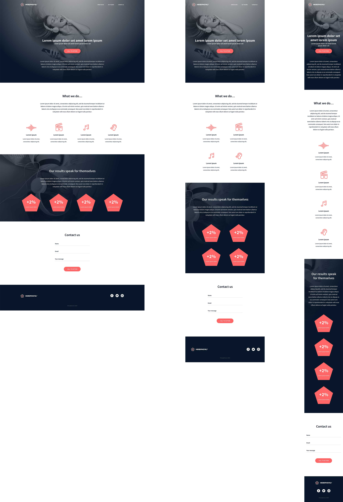

# Implement a Design from Scratch

In this project, we recreate a specific web page from scratch without using any
libraries. We will use all HTML/CSS/Accessibility/Responsive design skills that
we previously learned. This will be done without much of instruction. The goal
is simple: Have a fully functional web page that looks the same as the designer
file on Figma, which can be found [here](https://www.figma.com/design/FfnVADRC9xgI3yiZliTBYZ/Holberton-School---Headphone-company?node-id=0-1&p=f&t=flRs5nrNmJX9IxOc-0).

**[You can view the project on GitHub Pages here](https://zytronium.github.io/atlas-headphones/).**

    
Click here to show what the final product should look like on desktop, tablet, and mobile.

----

  
For a closer, more zoomed-in look at each individual one, click here
           to expand and show them.

## **Desktop:**  

## **Tablet:**  

## **Mobile:**  

----
For this project, we will assume the following:
- Mobile devices have a width of 480px or less.
- Tablets have a width of 767px or less
- Desktop/laptop screens have a width of 768px or more.

A mobile phone with a width of ~400px in portrait would trigger the CSS for
tablets when rotated to landscape. Depending on the phone, it may even trigger
the desktop CSS. My phone does.

The global CSS will be in [styles/styles.css](/styles/styles.css) (i.e., fonts, variables, and everything else all 3 variants share)
Desktop only CSS will be in [styles/desktop.css](/styles/desktop.css)
Tablet only CSS will be in [styles/tablet.css](/styles/tablet.css)
Mobile only CSS will be in [styles/mobile.css](/styles/mobile.css)

----
## Authors*
[Daniel S](https://github.com/Zytronium)  
[Cole K](https://github.com/ColeBiefrey)

###### * We did not create the original on Figma. We only recreated it with HTML and CSS

### Original Website
Designed by Nicolas Philippot, UI/UX designer

----

### Tasks checklist:
[//]: # ("​" comes before every number because otherwise, the
numbers will be formatted like "i, ii, iii, iv, etc." instead
of "1, 2, 3, 4, etc.". "​" is a zero-width space)
- [X] ​0. ReadMe and be familiar with Figma | Daniel
- [X] ​1. Header | Daniel
- [X] ​2. Body | Cole
- [X] ​3. "Our results" section | Daniel
- [X] ​4. Contact us | Cole
- [X] ​5. Footer | Cole
- [X] ​6. Host on Pages! | Daniel

- [X] **Everything Done ✓**